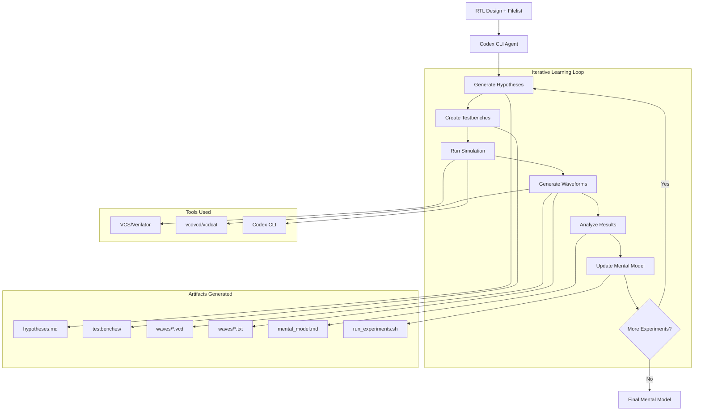

# Wavesense

## What it does?

Understanding of a chip design via experimentation

## How it does it?

Given an RTL design,

1. Generate interesting coverpoints / stimuli
2. Run simulation
3. Generate waveforms for these
4. Create a mental model of how the design behaves based on the generated artifacts
5. Repeat from step 1.

## Workflow Diagram



The workflow follows an iterative scientific method approach:

1. **Hypothesis Generation**: AI agent creates testable hypotheses about design behavior
2. **Experiment Design**: Generates testbenches and simulation scripts
3. **Execution**: Runs simulations using industry-grade EDA tools
4. **Observation**: Captures waveforms and converts to readable formats
5. **Analysis**: Updates mental model based on experimental results
6. **Iteration**: Continues until comprehensive understanding is achieved

## Implementation details

- Codex CLI as orchestrator agent with the following tools:
  - Regular bash commands
  - Verilator/VCS as simulator
- Compiled design as the environment
- Waveforms as the observations

## Usage

- `OPENAI_API_KEY=<your-key> python src/wavesense.py path/to/design.sv path/to/filelist.f my_artifacts_folder`

Some example designs and filelists are in the `example_rtl` folder.

## Requirements

- Codex CLI

```
npm install -g @openai/codex
```

~/.codex/config.toml

```
model = "gpt-5"

# full-auto mode
approval_policy = "on-request"
sandbox_mode    = "workspace-write"
```

- vcdvcd, vcdcat

```
pip install vcdvcd
```

- EDA simulators
  Preferably VCS as it is industry grade, verilator may also work based on the design.
